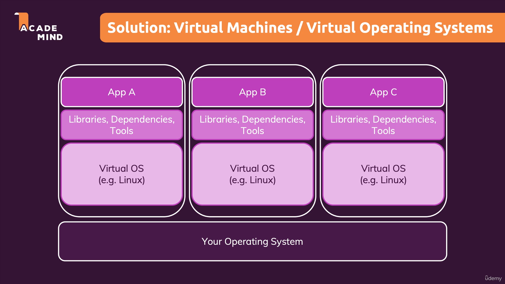
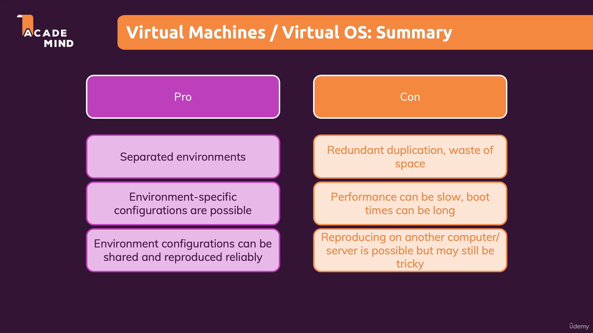

## Virtual Machines vs Docker Containers

When comparing virtual machines (VMs) and Docker containers, it's essential to understand their architecture, use cases, and benefits. Both are used to isolate applications, but they achieve this in fundamentally different ways.

### Virtual Machines

A virtual machine is a complete emulation of a physical computer. It runs its own operating system (OS) on top of a hypervisor, which manages multiple VMs on a single physical machine. Each VM includes:

- A full guest operating system (e.g., Windows, Linux).
- Virtualized hardware (e.g., CPU, memory, storage).
- Applications and their dependencies.

#### Pros

- **Isolation**: Each VM is completely isolated from others, making it highly secure.
- **Compatibility**: Can run different operating systems on the same physical machine.
- **Mature Technology**: VMs have been around for a long time and are well-supported.

#### Cons

- **Resource Intensive**: Each VM requires its own OS, consuming significant CPU, memory, and storage.
- **Slower Startup**: Booting a VM can take minutes due to the overhead of loading a full OS.
- **Less Portable**: VMs are larger in size and harder to move between environments.

### Docker Containers

Docker containers, on the other hand, are lightweight and share the host operating system's kernel. Instead of virtualizing hardware, Docker containers virtualize the OS. Each container includes:

- The application.
- Its dependencies (e.g., libraries, binaries).
- A minimal runtime environment.

#### Advantages

- **Lightweight**: Containers share the host OS kernel, making them smaller and faster.
- **Fast Startup**: Containers can start in seconds since they don't need to boot an OS.
- **Portability**: Containers can run consistently across different environments (e.g., development, testing, production).
- **Scalability**: Ideal for microservices and scaling applications horizontally.

#### Limitations

- **Shared Kernel**: Containers share the host OS kernel, which can be a security risk if not managed properly.
- **Less Isolation**: Compared to VMs, containers are less isolated, which might not be suitable for certain use cases.

### Real-Life Analogy

Imagine you are organizing a music festival:

- **Virtual Machines**: Each band gets its own stage, complete with separate sound systems, lighting, and crew. This ensures complete independence but is resource-intensive and takes time to set up.
- **Docker Containers**: Bands share a single stage but bring their own instruments and crew. They use the same sound system and lighting, making it faster and more efficient to switch between performances.

### When to Use What?

- **Use Virtual Machines**: When you need to run applications that require different operating systems or when strong isolation is a priority.
- **Use Docker Containers**: When you need lightweight, portable, and scalable solutions, especially for modern cloud-native applications and microservices.

By understanding these differences, you can choose the right tool for your specific needs.

