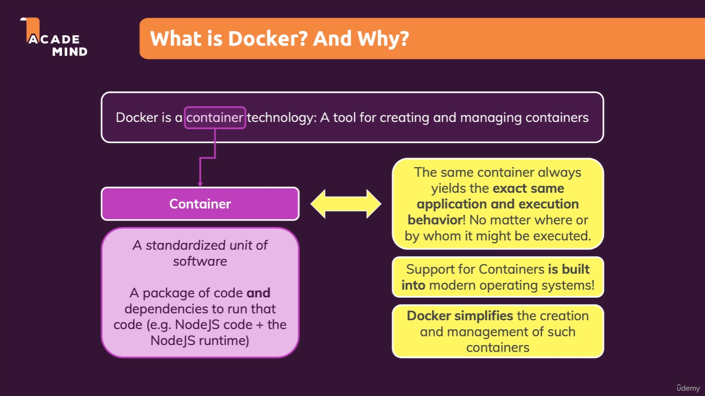

## Definition

- Docker is a container technology: A tool for creating and managing containers. It allows developers to package applications and their dependencies into a standardized unit called a container. These containers are lightweight, portable, and can run consistently across different environments, such as development, testing, and production.

## Real-Life Example

Imagine you are a software developer working on a web application. On your local machine, you use a specific version of Node.js and MongoDB to develop the application. However, when you deploy the application to a production server, it fails because the server uses a different version of Node.js or lacks MongoDB entirely.

With Docker, you can create a container that includes your application, the specific version of Node.js, MongoDB, and all other dependencies. This container can then be shared with your team or deployed to any server that supports Docker. Since the container includes everything your application needs, it will run the same way regardless of the underlying environment, eliminating the "it works on my machine" problem.

