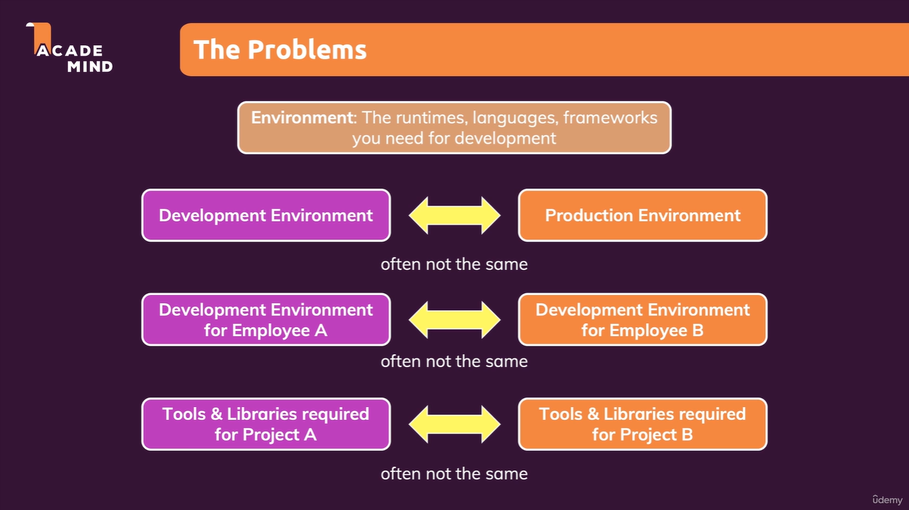

## Why Use Docker?

Docker is widely used because it simplifies the process of developing, shipping, and running applications. Here are some key reasons why Docker is beneficial:

- **Consistency Across Environments**: Docker ensures that your application runs the same way in development, testing, and production environments by packaging it with all its dependencies.
- **Resource Efficiency**: Containers are lightweight and share the host operating system's kernel, making them more resource-efficient compared to virtual machines.
- **Scalability**: Docker makes it easy to scale applications horizontally by running multiple containers of the same application.
- **Portability**: Docker containers can run on any system that supports Docker, whether it's a developer's laptop, a data center, or a cloud platform.

## Real-Life Example

Consider a scenario where a team of developers is working on a microservices-based application. Each microservice has its own dependencies, such as specific versions of programming languages, libraries, and databases. Setting up these dependencies on every developer's machine can be time-consuming and error-prone.

With Docker, each microservice can be packaged into its own container, including all its dependencies. Developers can simply pull the container images and run them on their machines without worrying about setup issues. This approach not only saves time but also ensures that the application behaves consistently across all environments.

